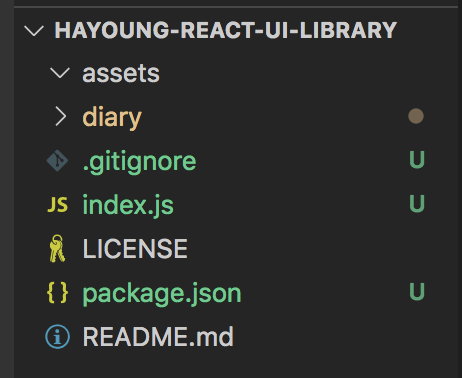
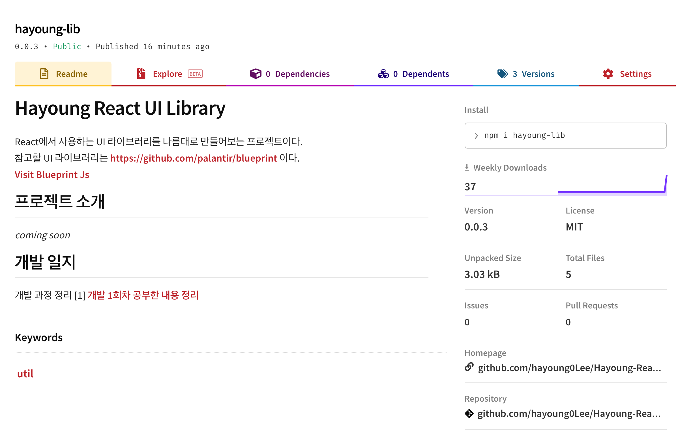
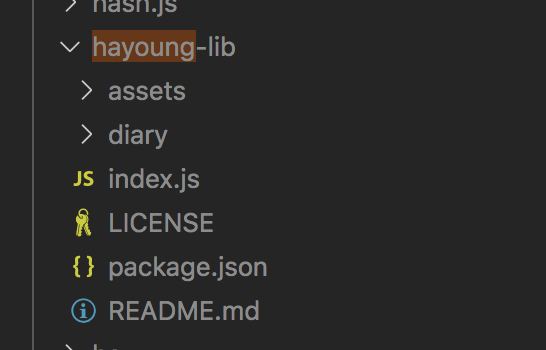
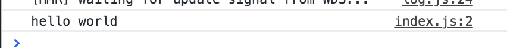

## 개발과정 1일차
### 내 질문
0. 어떻게 npm 저장소에 내 모듈을 올리고 사용할 수 있을까?

1. React Library의 구조는 어떻고 어떻게 만들어지는걸까?

### 공부하면서 참고한 자료들
- [npm 저장소에 패키지 등록하기 참고자료](https://falsy.me/npm-%EC%A0%80%EC%9E%A5%EC%86%8C%EC%97%90-%ED%8C%A8%ED%82%A4%EC%A7%80-%EB%93%B1%EB%A1%9D%ED%95%98%EA%B8%B0/)

- [조금 많이 자세한 npm 으로 타입스크립트 모듈 만들고 배포하는방법 자료](https://blog.ull.im/engineering/2018/12/23/how-to-create-and-publish-npm-module-in-typescript.html)

- [npmjs 사이트](https://docs.npmjs.com/creating-and-publishing-scoped-public-packages)


- [react 만들기](https://velog.io/@godori/build-your-own-react)


### 나의 첫 라이브러리 배포 방법
1. 프로젝트 구조<br/>


2. 내 라이브러리 페이지<br/>


3. Package.json 이란?
```
{
    "name": "hayoung-lib",  
    "version": "0.0.3", 
    "description": "dom script library", 
    "main": "index.js", 
    "scripts": {
      "test": "echo \"Error: no test specified\" && exit 1" 
    },
    "repository": { 
      "type": "git", 
      "url": "https://github.com/hayoung0Lee/Hayoung-React-UI-Library" 
    },
    "engines": {
      "node": ">=4.0.0" 
    },
    "keywords": ["util"], 
    "author": "Hayoung", 
    "license": "MIT", 
    "bugs": "https://github.com/hayoung0Lee/Hayoung-React-UI-Library", 
    "homepage": "https://github.com/hayoung0Lee/Hayoung-React-UI-Library" 
}
```
* name: 내가 만들 라이브러리의 이름을 지정한다. 나는 라이브러리의 이름을 'hayoung-lib'로 할 것이다.
* version: 버전 번호를 적는다. 이 번호는 라이브러리를 새로 업데이트 할때마다 숫자를 올려줘야한다. 
* description: 이 패키지(라이브러리)의 이름을 쓴다. 
* main: 첫시작 하는 파일의 이름을 쓴다. 나는 index.js에서부터 시작하니까, 'index.js'라고 썼다. 
* repository: 내 깃헙의 리포지토리를 쓴다. 
* engines: 지원되는 노드 버전을 쓴다. 
* keyword: 키워드
* author: 내이름
* license: 라이센스, 나는 MIT
* bugs, homepage: 각각 버그를 올리는 곳과 , 홈페이지 링크를 쓴다. 
<br/>

4. README.md 작성<br/>
  나는 이곳에 내 프로젝트에 대한 설명을 올렸다. 이 라이브러리는 일단 내가 공부하면서 사용할 라이브러리이기때문에, 내프로젝트를 설명하는 내용이 있을 예정이다. 
<br/>

5. index.js 작성
```
export const a = () => {
    console.log('hello world')
};
```

위처럼 이 모듈, 즉 <strong>_내가 만든 이 폴더구조를 통채로 가져다가 사용할 사람들이 내가 정의한 기능을 사용할 수 있도록 하기 위해_</strong> export해주는 것이 필요하다. 

위의 a는 함수로써, a() 하면 console에 hello world를 찍어주는 함수이다. 

6. npm registry에 등록하는 방법<br/>
  (1) https://www.npmjs.com/ 에 회원 가입하기! 이때 내 유저아이디와 패스워드 이메일을 잘 기억하자! <br/>
  (2) 터미널에서 <strong>npm adduser</strong> 하고 내 유저아이디, 패스워드, 이메일을 입력한다. <br/>
  (3) <strong>npm publish</strong> 를 통해 패키지를 배포한다. <br/>
  (4) 내가 원하는 프로젝트에서 <strong>npm install –save hayoung-lib</strong>> 하면 hayoung-lib의 최신버전이 설치된다. <br/>

7. 내가 만든 패키지 사용방법<br/>
  (1) 간단한 cra 앱을 생성한다. <br/>
  (2) <strong>npm install –save hayoung-lib</strong> 를 한다. 이후 node_modules 폴더에 가면 내가 만든 라이브러리가 hayoung-lib라는 이름으로 와있는 것을 확인할 수 있다. <br/>
  

  (3) 내 프로젝트에서 라이브러리 내의 함수 <strong>a</strong>를 불러 오기 <br/>
  ```
  import React from 'react';
  import logo from './logo.svg';
  import './App.css';
  import { a } from 'hayoung-lib'; // 내 라이브러리에서 함수를 불러온다. 

  function App() {
    a(); // 내 함수 실행
    return (
      <div className="App">
        <header className="App-header">
          
          <p>
            Edit <code>src/App.js</code> and save to reload.
          </p>
          <a
            className="App-link"
            href="https://reactjs.org"
            target="_blank"
            rel="noopener noreferrer"
          >
            Learn React
          </a>
        </header>
      </div>
    );
  }

  export default App;
  ```
  import { a } from 'hayoung-lib'; <br/>
  이 형태로 내 라이브러리의 컴포넌트를 불러올 수 있다. <br/>

  


