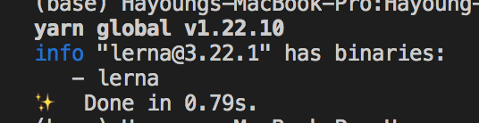

## 개발과정 2일차
### 내 질문
1. 패키지, 라이브러리, 모듈의 차이. 

2. package.json 의 동작원리

3. monorepo란? lerna, yarn workspaces


### 공부하면서 참고한 자료들
* [프로젝트 참조 하는 방법, yarn install, workspaces](https://musma.github.io/2019/04/02/yarn-workspaces.html)

* [package.json 속성](https://docs.npmjs.com/files/package.json) ([더 상세한 블로그 설명](https://programmingsummaries.tistory.com/385))

  반정도 이해 못한것 같군.(물이 반이나!, 이해를 50프로나!!)

* [workspaces란?](https://classic.yarnpkg.com/en/docs/workspaces/) <br/>
  
  - `It allows you to setup multiple packages in such a way that you only need to run yarn install once to install all of them in a single pass.`
  여러 패키지를 yarn install 한번으로 설치할 수 있도록 만든 기능이다. workspace 를 사용할 때는 
      ```
      private: true,
      workspaces: [...],
      ```
  가 필수다.

  - [npm link](https://simsimjae.tistory.com/385)를 쉽게 할 수 있게 해준 기능이라고도 나온다. npm link란 것은 내가 이해한바에 따르면, a라는 모듈이 b를 사용하는데, b에 뭔가 문제가 있을때, a/node_modules의 b를수정하면 이때는 동작하지만, 결국에 문제가 있는 놈은 b가 아닌가? 그래서 차라리 b로 가는 링크를 걸어둬서 원인한테 직접 가서 고치도록 하는 것으로 이해했다(좀더 이해하고 나면 바뀔수도!)

* npm, yarn 차이
  * [npm과 yarn 비교](https://medium.com/@ehddnjs8989/npm-vs-yarn-3a611c89d291)<br/>
  * [패키지 매니저 선택](https://velog.io/@qksud14/portfolio-03)<br/><br/>

  안정성과 관련된 차이가 있긴했으나, 성능차이는 현재 많이 좁혀졌다고 함. <br/><br/>

* 패키지, 라이브러리, 모듈의 차이: <br/>`모듈은 어떤 하나하나의 기능/ 패키지가 영업부, 홍보부, 이런 단위라면 라이브러리는 회사입니다.`


### blueprint js 설치
  - npm install -g yarn
  - yarn install
  - yarn verify


### monorepo 의 개념에 대해서 이해하기 위해 참고한 자료들
* monorepo(하위에 여러개의 패키지를 동시에 관리하는 프로젝트)
  * [lerna](https://lerna.js.org/)
    - mono-repo란 하나의 리포지토리에 다양한 프로젝트를 포함시키는 것이다. 이런 프로젝트는 워크스페이스나 패키지이다. blueprint js에서는 이 라이브러리의 다양한 패키지가 하나의 blueprint 리포지토리에서 개발되고 관리되고있다. 
    - 여러개의 프로젝트가 있고 각 프로젝트는 각각 package.json파일을 가지고 있고, 각각 퍼블리시 될 수 있다. 서로 디펜던시가 있을 수 있는데, 이런 디펜던시는 심볼릭링크를 사용한다. 
    - 'lerna and yarn workspaces'를 통해서 하나의 리포에서 여러 프로젝트를 관리할 수 있게 되었다. (npm publish 등을 하지 않고도.) 그리고 각 프로젝트의 package.json만 봐도 서로의 디펜던시를 확인할 수 있고, npm link(직접 연결하는거)도 이제 안해도 된다. 
    - <strong>[레르나에 대해 설명이 잘된 튜토리얼](https://kdydesign.github.io/2020/08/25/mono-repo-lerna.html#%E1%84%90%E1%85%B3%E1%86%A8%E1%84%8C%E1%85%B5%E1%86%BC)</strong> <br/><br/>


  * [mono-repo를 잘 설명해주는 한국어 블로그(한국어가 좋다 역시)](https://medium.com/jung-han/lerna-%EB%A1%9C-%EB%AA%A8%EB%85%B8%EB%A0%88%ED%8F%AC-%ED%95%B4%EB%B3%B4%EB%9F%AC%EB%82%98-34c8e008106a) <br/><br/>


  * [Why Lerna and Yarn Workspaces is a Perfect Match for Building Mono-Repos – A Close Look at Features and Performance](https://doppelmutzi.github.io/monorepo-lerna-yarn-workspaces/) <br/><br/>


### 내 프로젝트 monorepo구조로 변경하기(lerna 적용하기)

* 기존의 프로젝트 구조
``` // package.json
{
    "name": "hayoung-lib",  
    "version": "0.0.6", 
    "description": "dom script library", 
    "main": "index.js", 
    "scripts": {
      "test": "echo \"Error: no test specified\" && exit 1" 
    },
    "repository": { 
      "type": "git", 
      "url": "https://github.com/hayoung0Lee/Hayoung-React-UI-Library" 
    },
    "engines": {
      "node": ">=4.0.0" 
    },
    "keywords": ["util"], 
    "author": "Hayoung", 
    "license": "MIT", 
    "bugs": "https://github.com/hayoung0Lee/Hayoung-React-UI-Library", 
    "homepage": "https://github.com/hayoung0Lee/Hayoung-React-UI-Library" 
}
```
이런 package.json파일에 npm publish를 통해서 패키지를 업로드 했다. 

<[튜토리얼](https://kdydesign.github.io/2020/08/27/mono-repo-lerna-example.html#log-core-%E1%84%89%E1%85%AE%E1%84%8C%E1%85%A5%E1%86%BC)>

1. yarn 을 통해서 관리하기 위해  `yarn global add lerna`를 통해 설치한다. 
2. yarn global list 를 통해 display yarn globally installed packages<br/>

3. lerna init을 통해 lerna.json, package.json, packages/ 폴더를 생성한다. 

4. lerna create log-cli, lerna create log-core
5. yarn add eslint --dev --ignore-workspace-root-check

.... 어려운 내용이 많아서 Day3에서 blueprint js를 좀더 공부하면서 내용을 정리하려고 한다. 


lerna ERR! E402 You must sign up for private packages
yarn config set access public

scope란?
lerna ERR! E404 Scope not found
