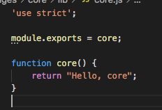
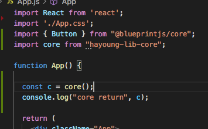
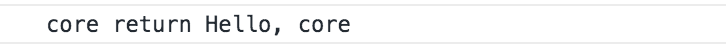

## 개발과정 2일차
### 내 질문
1. 왜 이렇게 설정파일이 많은건지.. 이걸 다 알 수 있는건지.. 세상은 왜이렇게 각박하기만 한건지...
2. npm과 yarn의 관계 좀더 명확하게 정리해보기
3. eslint가 뭔지 - 쓰긴 쓰는데 이게 뭐냐!! 물었을때 뭔지는 잘 모르는 느낌
4. prettier이란? - 이것도 쓰긴쓰는데 이게 뭐냐!! 하면 뭔지 잘모르겠는 느낌

### 프로젝트 목표
core 형태 카피해보기(디펜던시가 있든 없든 한번 해보기)<br/>


### npm vs yarn
- npm 과 yarn 둘다 npm repository에서 패키지를 다운로드 받지만, yarn은 설치된 모든 패키지를 캐쉬로관리한다는 차이점이 있다. [참고자료](https://waverleysoftware.com/blog/yarn-vs-npm/)

- [yarn은 속도때문에 나온거긴한데, 이제 npm 도 많이 빨라져서 편한거 쓰면 될것 같다는 의견도 있다.](https://cntechsystems.tistory.com/34)<br/>

- [npm으로 관리할때 생성되는 package-lock.json은 반드시 리포지토리에 올리자](https://hyunjun19.github.io/2018/03/23/package-lock-why-need/)<br/>
    * 이유: package.json에는 version range가 사용되서 특정버전이 아니라 버전의 범위가 나온다. 그러다보니 가끔 npm install 했을때, 패키지가 새로운 버전이 나오거나 했으면 업데이트된 버전이 설치될수가 있다. 이때 종종 오류가 발생하기도 한다. 이때 package-lock.json 이 있으면 원래 어떤 버전, _즉, 이 파일이 작성된 시점의 버전을 설치할 수 있다는 것을 보장한다_

- yarn.lock 과 package-lock.json 중 하나는 꼭 올려주자. [그에 관련된 자료(https://stackoverflow.com/questions/44552348/should-i-commit-yarn-lock-and-package-lock-json-files)

- [최종으로 잘 정리된 자료](https://www.daleseo.com/js-package-locks/)
    * 패키지 잠금 파일은 잘 관리하자! package.json에 새로운 패키지가 등록되면, package-lock.json에도 최초로 추가됬을때 정확히 어떤 버전이 설치된건지 기록해준다. 
    * package.json과 package-lock.json이 둘다 올려져있어야 다른 사람들이 다운로드받고 설치할때 두 파일을 모두 참고해서 모든 개발자들이 동일한 개발환경을 만들수잇다!(적어도 패키지 버전 관련해서...!!)

### [eslint 란?](https://eslint.org/docs/user-guide/getting-started)
```
ESLint is a tool for identifying and reporting on patterns found in ECMAScript/JavaScript code, with the goal of making code more consistent and avoiding bugs. In many ways, it is similar to JSLint and JSHint with a few exceptions:
```
  - 이건 설치하면 'devDependencies'에 설치된다. 왜냐하면 개발에만 필요한 패키지이기 때문이다. 

  - tslint안쓰고 eslint인 이유: [링크](https://medium.com/@pks2974/tslint-%EC%97%90%EC%84%9C-eslint-%EB%A1%9C-%EC%9D%B4%EC%82%AC%ED%95%98%EA%B8%B0-ecd460a1e599) -> 이제 업데이트 안한다고함

  - eslint의 rule들: [링크](https://eslint.org/docs/rules/)

  - [카카오 기술 블로그 내용 - 직접 규칙을 만드는 방법](https://tech.kakao.com/2019/12/05/make-better-use-of-eslint/) : 아직 이해는 안되지만 한번 해보고 싶은 내용

### [prettier](https://www.daleseo.com/js-prettier/)
코드 포매터로 주로 ESLint같은 린터와 함께 쓴다. 

`eslint는 오류를 잡아주지만 자동으로 변경해주는 데 한계가 있고,
prettier는 자동으로 변경해주는 부분이 eslint보다 많지만 코드 품질을 잡아주진 않습니다.
그래서 각각의 미진한 점들을 보완하여 사용합니다.` from [here](https://velog.io/@susu1991/%EA%B0%9C%EB%B0%9C%ED%99%98%EA%B2%BD%EC%8B%9C%EB%A6%AC%EC%A6%88-prettier)


### core 폴더 만들기
1. [튜토리얼](https://kdydesign.github.io/2020/08/27/mono-repo-lerna-example.html) 를 참고해서 lerna create core를 통해 폴더를 생성했다. <br/>


2. core.js에 간단한 함수 하나를 선언했다. <br/>


3. lerna publish를 통해서 패키지를 npm registry에 올렸다. <br/>
4. react app 등에서 설치한다. <br/>
5. app에서 사용<br/>

6. 화면에서 결과물 <br/>
